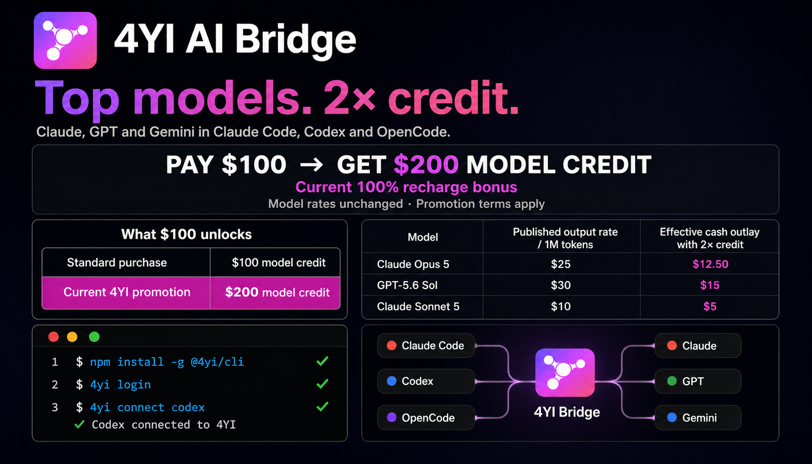
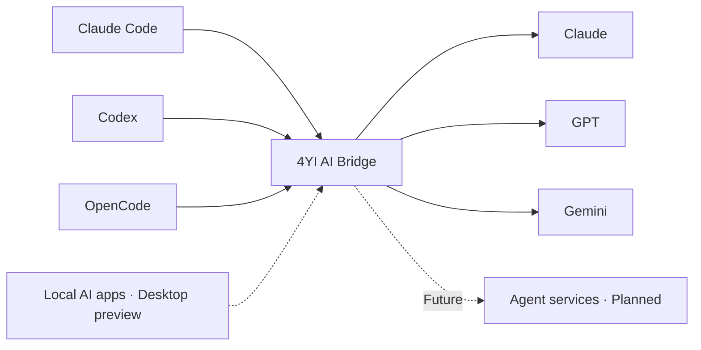

<p align="center">
  
</p>

<h1 align="center">4YI AI Bridge</h1>

<p align="center">
  One secure bridge for Claude Code, Codex, OpenCode, and local AI apps.
</p>

<p align="center">
  <a href="https://www.npmjs.com/package/@4yi/cli"></a>
  
  
  
  <a href="LICENSE"></a>
</p>



> **Top models. 2× model credit.** During the current promotion, pay for $100 of model credit and receive $200 to use. Published model rates remain unchanged; the lower effective cash outlay comes from promotional bonus credit. [Review the terms](PROMOTION.md) before purchasing.

<p align="center">
  <a href="https://app.4yi.ai/code?utm_source=github&utm_medium=repo_readme&utm_campaign=4yi-ai-bridge"><strong>Get your API key</strong></a>
  ·
  <a href="https://gateway.4yi.ai/pricing?utm_source=github&utm_medium=repo_readme&utm_campaign=4yi-ai-bridge">Full model pricing</a>
  ·
  <a href="PROMOTION.md">Promotion terms</a>
  ·
  <a href="docs/architecture.md">How it works</a>
</p>

## Install in 30 seconds

Install the CLI, sign in securely through the 4YI web app, then connect the tool you already use:

```bash
npm install -g @4yi/cli
4yi login
4yi connect codex
```

The CLI checks the target application, backs up the existing configuration, and applies the 4YI connection. Restore your previous settings at any time:

```bash
4yi restore all
```

Preview every affected file without signing in, installing another CLI, or changing configuration:

```bash
4yi connect all --dry-run
4yi doctor
```

See the complete [CLI reference](docs/cli.md) and [troubleshooting guide](docs/troubleshooting.md).

## Supported tools

| Tool | Start command | What 4YI does |
| --- | --- | --- |
| Claude Code | `4yi connect claude` | Connects the installed Claude Code CLI to 4YI |
| Codex | `4yi connect codex` | Creates a 4YI Codex profile using the Responses API |
| OpenCode | `4yi code` | Installs and launches an isolated OpenCode runtime with 4YI routing |
| Other local AI apps | Desktop preview | Will expose a local OpenAI-compatible bridge |

Desktop support is under active development. Agent services are planned and are not included in the current CLI release.

## SOTA model value

The promotion does **not** change model unit rates. It adds 100% bonus credit, so the same cash payment buys twice the usable model credit.

| Model example | Published input / output rate per 1M tokens | Effective cash outlay with current 2× credit |
| --- | ---: | ---: |
| Claude Opus 5 | $5 / $25 | $2.50 / $12.50 |
| GPT-5.6 Sol | $5 / $30 | $2.50 / $15 |
| Claude Sonnet 5 | $2 / $10 | $1 / $5 |

Effective cash outlay is an illustration of promotional bonus credit, not a change to the published per-token model rate. Model availability, prices, promotion eligibility, and credit rules can change. Check the [live pricing page](https://gateway.4yi.ai/pricing?utm_source=github&utm_medium=repo_pricing&utm_campaign=4yi-ai-bridge) before use.

## How it works



The CLI and future desktop app are local clients. Authentication, usage controls, billing, and production model routing remain in the hosted 4YI service.

## Repository contents

| Path | Purpose |
| --- | --- |
| [`packages/cli`](packages/cli) | MIT-licensed `@4yi/cli` source and tests |
| [`examples`](examples) | Curl, Python, and TypeScript API examples |
| [`docs`](docs) | CLI, troubleshooting, and architecture documentation |
| [`.github`](.github) | CI, security, release automation, and community templates |

The hosted gateway, billing system, provider credentials, routing policy, fraud controls, customer data, and infrastructure configuration are intentionally not part of this repository.

The endpoints used by public clients are summarized in the [public client/service contract](docs/service-contract.md).

## API examples

The hosted service exposes an OpenAI-compatible endpoint. Start with the [examples directory](examples) after creating an API key and selecting a model available to your account.

## Security and privacy

- Browser-based sign-in avoids pasting a long-lived platform credential into the terminal.
- Client configuration is backed up before changes are applied.
- Credentials, local configuration, prompts, and logs must never be posted in public issues.
- Security reports should follow [SECURITY.md](SECURITY.md), not a public GitHub issue.

See the 4YI service terms and privacy policy for hosted-service data handling. This public repository does not contain the 4YI control plane, billing implementation, production routing policy, or infrastructure configuration.

## Roadmap

- [x] Public CLI source, tests, and release-ready npm package
- [x] Secure web sign-in
- [x] Claude Code and Codex connection helpers
- [x] Isolated OpenCode launcher
- [ ] Desktop bridge for local OpenAI-compatible applications
- [ ] Per-application routing and connection health
- [ ] User-friendly agent services

Roadmap items are directional and do not promise a release date. Follow [Discussions](https://github.com/4yi-ai/4yi-ai-bridge/discussions) for updates.

## Community

- Ask usage questions in [GitHub Discussions](https://github.com/4yi-ai/4yi-ai-bridge/discussions).
- Report reproducible CLI bugs with the [bug template](.github/ISSUE_TEMPLATE/bug_report.yml).
- Suggest integrations or workflows with the [feature template](.github/ISSUE_TEMPLATE/feature_request.yml).
- Read [CONTRIBUTING.md](CONTRIBUTING.md) before opening a pull request.
- Use [SUPPORT.md](SUPPORT.md) to choose the correct public or private support channel.
- Track release gates in the [product roadmap](docs/roadmap.md).

## License and trademarks

Public source and documentation in this repository are licensed under the [MIT License](LICENSE), unless a file says otherwise. The hosted 4YI service is a separate commercial product and is not licensed by this repository.

4YI is an independent service and is not affiliated with Anthropic, OpenAI, Google, or the OpenCode project. Third-party product names and trademarks belong to their respective owners. See [NOTICE.md](NOTICE.md).
