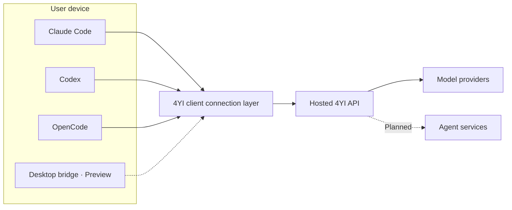
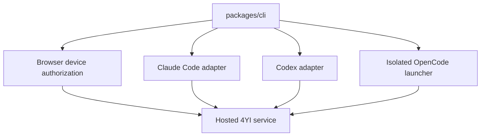

# Architecture and public/private boundary

4YI AI Bridge is the local connection layer for supported AI applications.

## Public repository scope

This repository may contain local client code, public configuration adapters, examples, tests, documentation, and release automation.

It does not contain production credentials, customer data, hosted billing logic, internal control-plane code, production routing policy, fraud controls, or infrastructure configuration.

## Current components

The CLI contains only client-side authentication, local configuration, compatibility adapters, and public request handling. Service-side implementations for the `/api/cli/*` and model gateway endpoints remain private.

## Planned desktop boundary

The desktop application will compose a loopback-only bridge daemon, operating-system credential storage, client discovery, and a signed desktop shell. The daemon must authenticate local clients separately from the hosted 4YI credential and must not listen on a non-loopback interface by default.

## Configuration safety

Connection helpers should:

1. detect the target application and configuration location;
2. show the proposed change;
3. back up existing configuration before writing;
4. avoid overwriting unrelated user settings;
5. provide status and restore commands; and
6. never print credentials in normal output.
